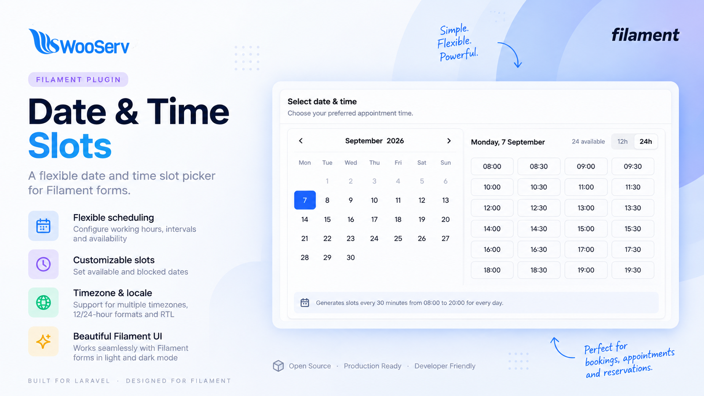

# Filament Date Time Slots

A Filament form field that displays a calendar and configurable future time slots for appointments, tasks, reservations, and scheduling workflows.

[](https://github.com/wooserv/filament-date-time-slots/actions/workflows/compatibility.yml)
[](https://packagist.org/packages/wooserv/filament-date-time-slots)
[](https://packagist.org/packages/wooserv/filament-date-time-slots)
[](LICENSE)

<p align="center">
    
</p>

## Features

- Inline calendar with configurable working hours.
- Explicit available slots and blocked/booked slots.
- Configurable slot interval and minimum lead time.
- Past dates and past slots are disabled automatically.
- 12-hour / 24-hour display toggle without changing the stored value.
- Timezone, locale, RTL, and dark-mode support through Filament assets.
- Horizontal layout by default on containers wide enough, with a responsive vertical fallback.
- Independently scrollable time slots in both horizontal and vertical layouts.
- Stores one predictable datetime value; no separate appointment table is required.

## Installation

```bash
composer require wooserv/filament-date-time-slots
```

Views can optionally be published:

```bash
php artisan vendor:publish --tag="date-time-slots-views"
```

The package registers its service provider automatically through Laravel package discovery. The compiled JavaScript and CSS are included in the package, so consumers do not need Node.js to use the field.

## Usage

```php
use WooServ\FilamentDateTimeSlots\Forms\Components\DateTimeSlotPicker;

DateTimeSlotPicker::make('due_at')
    ->label('Due at')
    ->format('Y-m-d H:i')
    ->minDate(now())
    ->minimumLeadTime(30)
    ->slotInterval(30)
    ->workingHours([
        'sunday' => ['09:00', '17:00'],
        'monday' => ['09:00', '17:00'],
    ])
    ->blockedSlots([
        '2026-09-07' => ['10:30', '12:00'],
    ])
    ->required();
```

Use `availableSlots()` when the caller already knows the exact slots for a date:

```php
DateTimeSlotPicker::make('due_at')
    ->availableSlots([
        '2026-09-07' => ['09:00', '09:30', '11:00'],
    ]);
```

`workingHours()` accepts weekday names (`sunday` through `saturday`) or numeric day keys. `blockedSlots()` marks booked slots as unavailable. Use `showBlockedSlots()` to display those booked slots instead of hiding them.

The value is stored using the format passed to `format()`. The 12-hour / 24-hour switch changes presentation only and never changes the stored value.

### Available configuration

```php
DateTimeSlotPicker::make('due_at')
    ->firstDayOfWeek(1)
    ->weekStartsOnMonday()
    ->minDate(now())
    ->maxDate(now()->addMonths(3))
    ->disabledDates(['2026-09-18'])
    ->timezone('Africa/Cairo')
    ->locale('en')
    ->showBlockedSlots();
```

`availableSlots()` takes priority over generated working-hour slots for the matching date. `minimumLeadTime()` applies to both the calendar and the individual time slots, preventing selections that are too close to the current time.

The picker uses a horizontal layout by default when its container is at least `48rem` wide. On smaller containers, including mobile layouts, it falls back to a vertical layout automatically. The width is measured from the field's own container, so narrow Filament grid columns remain vertical even on larger screens.

Use `vertical()` to force the vertical layout at every width:

```php
DateTimeSlotPicker::make('due_at')
    ->vertical();
```

Time slots use an independent scroll area in both layouts. The vertical layout keeps a minimum height and a bounded height so a large number of slots does not expand the entire form.

## Testing

```bash
composer install
composer test
```

To format the PHP source using the package rules:

```bash
composer format
```

The package test suite uses PHPUnit and Orchestra Testbench. The repository CI tests the supported Filament/Laravel combinations instead of relying on one locally installed framework version.

## Building assets

The distributable assets are committed to `resources/dist`, so building is only needed when changing the package frontend source:

```bash
npm install
npm run build
```

## Compatibility

- PHP 8.2+
- Filament 3.2, 4, or 5
- Laravel 11, 12, or 13
- Laravel package discovery

Supported combinations are tested in CI: Filament 3 with Laravel 11, Filament 4 with Laravel 11/12, and Filament 5 with Laravel 12/13. PHP 8.2 is supported with Laravel 11/12; Laravel 13 requires PHP 8.3.

## Changelog

Please see [CHANGELOG](CHANGELOG.md) for more information on what has changed recently.

## Contributing

Please see [CONTRIBUTING](.github/CONTRIBUTING.md) for details.

## Security Vulnerabilities

Please review [our security policy](.github/SECURITY.md) on how to report security vulnerabilities.

## Credits

Maintained by [WooServ, LLC](https://wooserv.com):

- [WooServ](https://github.com/wooserv)
- [Hamada Habib](https://github.com/ihfbib)
- [All Contributors](../../contributors)

## License

The MIT License (MIT). See the [License File](LICENSE) for more information.
